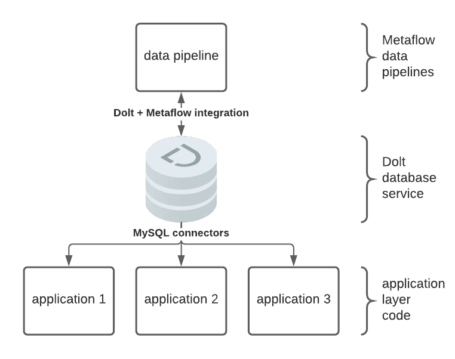
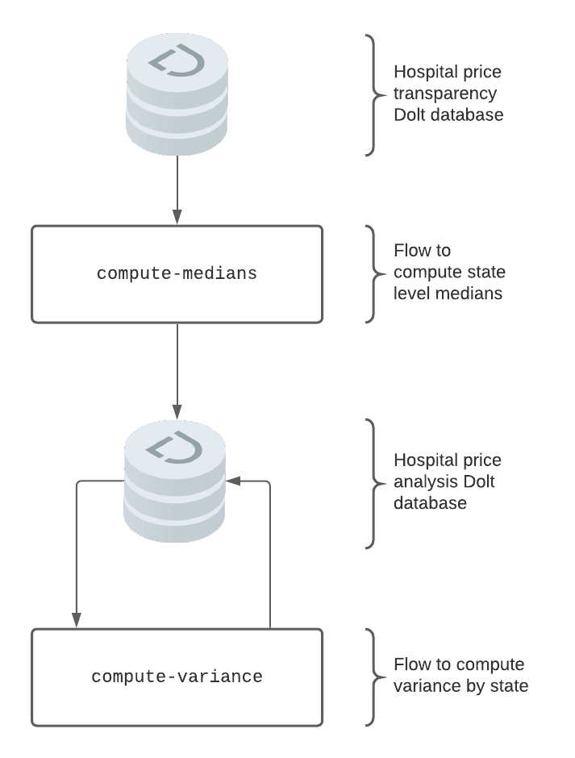
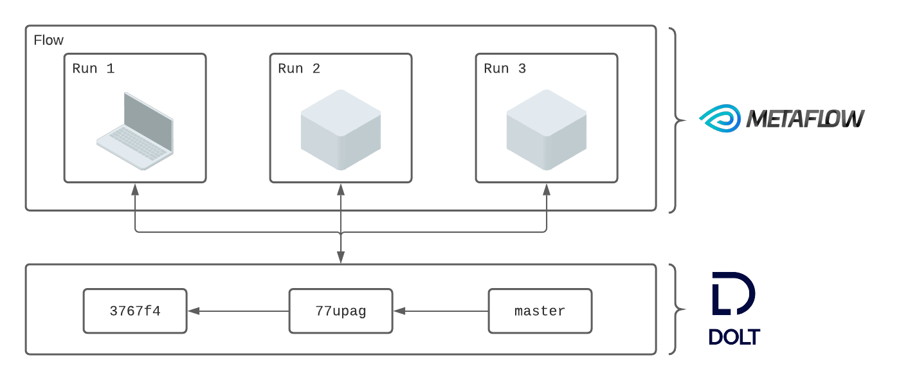
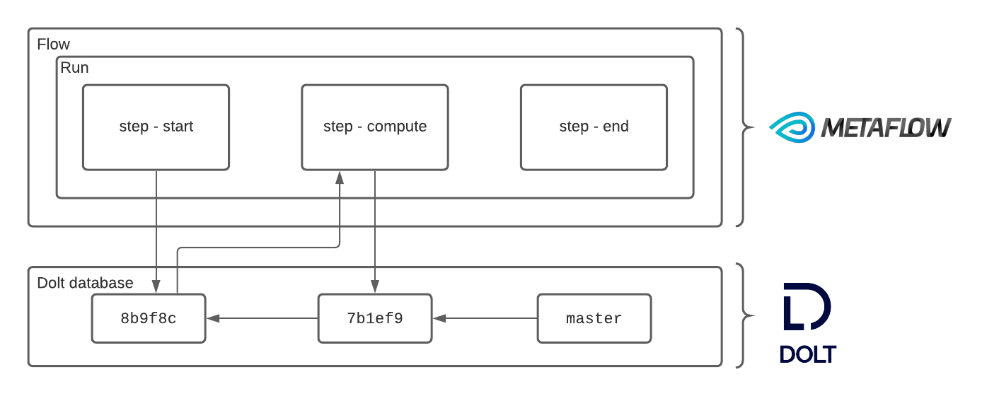
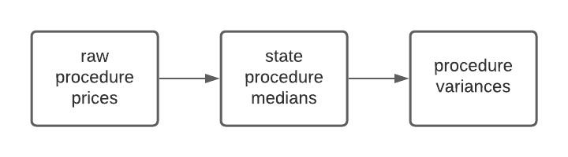

## Background
This post details how to use Metaflow with Dolt. [Metaflow](https://metaflow.org/) is a workflow manager that offers data scientists the ability to define local experiments and scale those experiments to production jobs from a single API. [Dolt](https://docs.dolthub.com/) is a version controlled relational database. It provides a familiar SQL interface along with Git-like version control features. Each commit corresponds to the state of the database at the time the commit was created. Both Dolt and Metaflow are open source.

To illustrate the power of integrating Metaflow and Dolt, we use an example Metaflow pipeline to derive results data from an input dataset. We read the input data into a Pandas DataFrame and convert that DataFrame to permanent storage in Dolt for use with application layer services with an intermediate step. Dolt SQL Server can be used to serve this versioned and reproducible data over MySQL connectors:



This blog post will breakdown how to use Dolt to augment Metaflow based pipelines with full reproducibility, lineage, and back-testing capabilities for tabular data. Dolt allows users to see where their data came from, what it looked like at every transformation, and to feed historical versions of it into subsequent flow runs.

## Example Pipeline
Our pipeline consists of two flows. One flow consumes the results written by the other. The first flow computes the state level median price for a hospital procedure. The second flow computes the variance of the price for a procedure across states. For input data we chose a new public [dataset](https://www.dolthub.com/repositories/dolthub/hospital-price-transparency) of 1400 US hospital prices created using DoltHub [data bounties](https://www.dolthub.com/bounties). Our pipeline will look something like this:



We will use the end result to illustrate how integrating Dolt and Metaflow provides Metaflow users with the ability to traverse versions of their final data, as well as traceback through the pipeline to examine various stages. Users can do this via the Metaflow API and Dolt integration in a familiar environment like a console or a notebook.

## How it Works
Our design goal with this integration was to give the Metaflow user additional capabilities directly from Metaflow. We wanted to minimize additional API surface area.

Workflows in Metaflow are called "flows." Each flow stores metadata about flow execution, referred to as a "run." Each time a run interacts with Dolt, we capture a small amount of metadata to make that interaction reproducible. We create a mapping between Metaflow runs and Dolt commits to provide users with powerful lineage and reproducibility features.

Runs of a flow read and write Pandas DataFrame objects to Dolt:



Individual steps of a run can create separate commits that snapshot the state of the database following a write:



When a flow reads data from Dolt, it records exactly how that data was read inside Metaflow. When a flow writes to Dolt it creates a commit and captures the metadata, as well as formatting the commit message. This allows users to browse the inputs and outputs of their flows from the Metaflow API directly without having to know much of anything about Dolt. Furthermore users can retrieve the flow that last touched a table at a given branch or commit, also directly from the Metaflow API. 

This is all abstract, so let's install a few dependencies, grab a dataset, and get stuck into running our pipeline.

## Setup
Let's get the boring stuff out of the way. We need the following:
- Dolt and `doltpy-integrations` installed
- Metaflow installed
- the sample dataset we will use, which can easily clone from DoltHub

### Install Dolt
The first step is to install Dolt on a `*nix` system:
```
sudo bash -c 'curl -L https://github.com/dolthub/dolt/releases/latest/download/install.sh | bash'
```

There are Windows distributions and a Homebrew cask. Find more details about installation [here](https://docs.dolthub.com/getting-started/installation).

### Install doltpy-integrations[metaflow]
Next let's install the Metaflow + Dolt integration. It comes packaged with both Metaflow, and Dolt's Python API, Doltcli. It's easy enough to install via `pip`:
```
pip install doltpy-integraions[metaflow]
```

### Get The Data
The final step is to acquire the dataset. Because Dolt is a SQL database with Git-like version control features, it includes the ability to clone a remote to your local machine. We can use that feature to easily acquire a Dolt database from a remote:
```
$ dolt clone dolthub/hospital-price-transparency && cd hospital-price-transparency
```

Note this dataset is nearly 20 gigabytes, and could take a few minutes to clone. Once it's landed it's straightforward to jump right into SQL:
```
$ dolt sql
# Welcome to the DoltSQL shell.
# Statements must be terminated with ';'.
# "exit" or "quit" (or Ctrl-D) to exit.
hospital_price_transparency> show tables;
+-----------+
| Table     |
+-----------+
| cpt_hcpcs |
| hospitals |
| prices    |
+-----------+
```

At the outset we said we were going to store the results in Dolt. To do so we need to create a Dolt database to write to:
```
$ mkdir ~/hospital-price-analysis && cd ~/hospital-price-analysis
$ dolt init
Successfully initialized dolt data repository.
```

We are now ready to start running our Metaflow based pipeline.

## Using Metaflow
Before we get into the details, let's first produce a run of our pipeline off the latest version of the upstream database. The first flow computes the median cost of a given hospital procedure at the state level:
```
$ poetry run python3 hospital_procedure_price_state_medians.py run \ 
    --hospital-price-db path/to/hospital-price-transparency \ 
    --hospital-price-analysis-db path/to/hospital-price-analysis
Metaflow 2.2.8 executing HospitalPriceStateMedians for user:oscarbatori
Validating your flow...
    The graph looks good!
Running pylint...
    Pylint couldn't analyze your code.
    	Pylint exception: RecursionError('maximum recursion depth exceeded while calling a Python object')
    Skipping Pylint checks.
2021-04-07 08:50:36.934 Workflow starting (run-id 1617810636925188):
2021-04-07 08:50:36.941 [1617810636925188/start/1 (pid 21075)] Task is starting.
2021-04-07 09:02:36.095 [1617810636925188/start/1 (pid 21075)] Task finished successfully.
2021-04-07 09:02:36.136 [1617810636925188/end/2 (pid 21257)] Task is starting.
2021-04-07 09:02:37.697 [1617810636925188/end/2 (pid 21257)] Task finished successfully.
2021-04-07 09:02:37.698 Done!
```

The second flow computes the variance in median procedure price across states:
```
$ poetry run python3 hospital_procedure_price_variance_by_state.py run \ 
    --hospital-price-analysis-db path/to/hospital-price-analysis
Metaflow 2.2.8 executing HospitalProcedurePriceVarianceByState for user:oscarbatori
Validating your flow...
    The graph looks good!
Running pylint...
    Pylint couldn't analyze your code.
    	Pylint exception: RecursionError('maximum recursion depth exceeded while calling a Python object')
    Skipping Pylint checks.
2021-04-07 09:07:25.262 Workflow starting (run-id 1617811645255563):
2021-04-07 09:07:25.269 [1617811645255563/start/1 (pid 21299)] Task is starting.
2021-04-07 09:08:25.200 [1617811645255563/end/2 (pid 21349)] Task is starting.
2021-04-07 09:08:25.982 [1617811645255563/end/2 (pid 21349)] Task finished successfully.
2021-04-07 09:08:25.983 Done!
```

We now have our first result set computed. Let's access the computed variances via the integration, using the flow as an entry point:
```python
from metaflow import Flow
from dolt_integrations.metaflow import DoltDT
dolt = DoltDT(run=Flow('HospitalProcedurePriceVarianceByState').latest_successful_run)
df = dolt.read('variance_by_procedure')
print(df)
```

We see that we have successfully computed procedure level variance:
```
                  code        price
0        CPT® 86708,72      253.125
1        CPT® 86708,73      253.125
2        CPT® 86708,74      253.125
3        CPT® 86708,75      253.125
4        CPT® 86708,76      253.125
                ...          ...
1176694          nan,5   254148.840
1176695          nan,6   326868.470
1176696          nan,7   779888.100
1176697          nan,8  2152957.800
1176698          nan,9  4031522.000
[1176699 rows x 2 columns]
```

We have seen it's relatively straightforward to run our pipeline, and access our versioned results via a reference to the flow that produced them. We now dive into some of the capabilities this provides Metaflow users who choose to use Dolt in their infrastructure.

### Back-testing
In this example our input dataset is stored in Dolt. We used a DoltHub dataset because it's easy to clone the dataset and get started, and afterall this post is about integrating Dolt with Metaflow. But having our input dataset in Dolt isn't just a matter of convenience for this post. Because every Dolt commit represents the complete state of the database at a point in time, we can easily point our pipeline to historical versions of the data. Let's examine the Dolt commit graph and grab a commit straight from the SQL console:
```
$ cd path/to/hospital-price-transparency
$ dolt sql
# Welcome to the DoltSQL shell.
# Statements must be terminated with ';'.
# "exit" or "quit" (or Ctrl-D) to exit.
hospital_price_transparency> select commit_hash, message from dolt_commits where `date` < '2021-02-17' order by `date` desc limit 10;
+----------------------------------+------------------------------------------------------------+
| commit_hash                      | message                                                    |
+----------------------------------+------------------------------------------------------------+
| f0lecmblorr67rcuhuti6tbkriigh6gt | Updating prices with changes from uwmc_prices.csv          |
| mj9ce6d8em9avj9ej0pqnaoes4fbglti | Updating cpt_hcpcs with changes from uwmc_cpt_hcpcs.csv    |
| 2j6ommult20qvbj05j1nq63nkbd5fgdj | Updating prices with changes from prices.csv               |
| pu8ctvhfcpp83q3iil8trp90vnuesaci | Updating cpt_hcpcs with changes from cpt_hcpcs.csv         |
| q49l0kgnbbbgkt3imjd57tslbi2iges8 | Updating hospitals with changes from hospitals.csv         |
| gstcq5loi9ieqdv1elrljab9hcgr090p | Updating hospitals with changes from hospitals.csv         |
| te6spcqtjk0scose2c45f9t7tpcrt69c | Added hospital WellSpan Surgery & Rehabilitation Hospital. |
| bjg3b5lua8omadcl5nr6o7v0nphliqpu | Added hospital WellSpan York Hospital.                     |
| t4js1g5mfvgikqlmqa238it26mg94g5i | Added hospital Children's of Alabama.                      |
| jsan7p4iad61cjmeti858ebcl4s86vda | Added hospital McLaren Lapeer Region.                      |
+----------------------------------+------------------------------------------------------------+
```

Suppose we'd like to run our pipeline with input data as of commit `gstcq5loi9ieqdv1elrljab9hcgr090p`, the first one labeled "Updating hospitals with changes from hospitals.csv." That's easy enough, first let's name the commit with a branch:
```
$ dolt branch metaflow-backtest gstcq5loi9ieqdv1elrljab9hcgr090p
```
Before recomputing the medians let's create a branch in our `hospital-price-analysis` database associated with the root commit to store these experiments:
```
$ cd path/to/hospital-price-analysis
$ dolt branch
* master
  metaflow-backtest
$ dolt checkout -b metaflow-change-test
Switched to branch 'metaflow-change-test'
```

Now let's kick off recomputing the medians. Since we are recomputing our medians from a historical version of the raw pricing data we will write them to a separate experimentation branch:
```
$ poetry run python3 hospital_procedure_price_state_medians.py run \ 
    --hospital-price-db path/to/hospital-price-transparency \ 
    --hospital-price-db-branch metaflow-backtest \
    --hospital-price-analysis-db path/to/hospital-price-analysis \
    --hospital-price-analysis-db-branch metaflow-backtest
Metaflow 2.2.8 executing HospitalPriceStateMedians for user:oscarbatori
Validating your flow...
    The graph looks good!
Running pylint...
    Pylint couldn't analyze your code.
    	Pylint exception: RecursionError('maximum recursion depth exceeded while calling a Python object')
    Skipping Pylint checks.
2021-04-07 09:20:00.883 Workflow starting (run-id 1617812400875290):
2021-04-07 09:20:00.889 [1617812400875290/start/1 (pid 21700)] Task is starting.
2021-04-07 09:20:20.254 [1617812400875290/start/1 (pid 21700)] Task finished successfully.
2021-04-07 09:20:20.264 [1617812400875290/end/2 (pid 21776)] Task is starting.
2021-04-07 09:20:21.422 [1617812400875290/end/2 (pid 21776)] Task finished successfully.
2021-04-07 09:20:21.423 Done!
```

And the variances can be run similarly, again using the experimentation branch:
```
$ poetry run python3 hospital_procedure_price_variance_by_state.py run \ 
    --hospital-price-analysis-db path/to/hospital-price-analysis \
    --hospital-price-analysis-db-branch metaflow-backtest
Metaflow 2.2.8 executing HospitalProcedurePriceVarianceByState for user:oscarbatori
Validating your flow...
    The graph looks good!
Running pylint...
    Pylint couldn't analyze your code.
    	Pylint exception: RecursionError('maximum recursion depth exceeded while calling a Python object')
    Skipping Pylint checks.
2021-04-07 09:21:12.296 Workflow starting (run-id 1617812472287058):
2021-04-07 09:21:12.303 [1617812472287058/start/1 (pid 21827)] Task is starting.
2021-04-07 09:21:16.321 [1617812472287058/end/2 (pid 21871)] Task is starting.
2021-04-07 09:21:17.283 [1617812472287058/end/2 (pid 21871)] Task finished successfully.
2021-04-07 09:21:17.284 Done!
```

We can now query the results directly from Python:
```python
from metaflow import Flow
from dolt_integrations.metaflow import DoltDT
dolt = DoltDT(run=Flow('HospitalProcedurePriceVarianceByState').latest_successful_run)
df = dolt.read('variance_by_procedure')
print(df)
```

Since this commit was taken from far earlier in the data gathering process, we can see far fewer unique procedure codes, 21K vs 1.17M:
```
           code        price
0         0001A    184.03088
1         0001M  12250.82000
2         0001U  35871.70000
3         0002A    275.67660
4         0002M      0.00000
         ...          ...
21332  L1830-00     13.41620
21333  L1830-01      9.24500
21334  L1830-02     20.22480
21335  L1830-03    247.53125
21336  L1830-04     35.70125
[21337 rows x 2 columns]
```

Or we can use Dolt SQL's `AS OF` syntax to query the results of our backtest:
```
$ cd path/to/hospital-price-analysis
$ dolt sql
# Welcome to the DoltSQL shell.
# Statements must be terminated with ';'.
# "exit" or "quit" (or Ctrl-D) to exit.
hospital_price_analysis> select * from variance_by_procedure as of 'metaflow-backtest' order by price desc limit 10;
+-------+---------------+
| code  | price         |
+-------+---------------+
| Q2042 | 5.9482256e+11 |
| Q2041 | 5.1718203e+11 |
| 216   | 1.2761694e+11 |
| J3399 | 9.192812e+10  |
| Q4142 | 1.604416e+10  |
| 0100T | 1.4931476e+10 |
| C9293 | 9.202785e+09  |
| 47133 | 8.558203e+09  |
| 90288 | 8.4152607e+09 |
| J7311 | 8.2143995e+09 |
+-------+---------------+
```

In this section we saw how storing flow inputs in Dolt makes back-testing straightforward. Dolt's commit graph makes it straight forward to specify a historical database state. 

### Reproducibility
Our pipeline contains two steps, one computes state procedure price medians, and the second computes procedure price variances across states. Suppose now that we would like to tweak the way we compute variances. We might like to exclude some outliers, or invalid procedure codes. In a production setting we might own the variances computation but not the medians computation, and have stricter criteria for excluding invalid data. Let's update our variances job and then recompute using a fixed.

Let's first look at our Flow definition to exclude corrupt procedure codes:
```python
@step
def start(self):
    analysis_conf = DoltConfig(
        database=self.hospital_price_analysis_db,
        branch=self.hospital_price_analysis_db_branch
    )

    with DoltDT(run=self.historical_run_path or self, config=analysis_conf) as dolt:
        median_price_by_state = dolt.read("state_procedure_medians")
        clean = median_price_by_state[~median_price_by_state['code'].str.startswith('nan')]
        variance_by_procedure = clean.groupby("code").var()
        dolt.write(variance_by_procedure, "variance_by_procedure")

    self.next(self.end)

```

Reproducibility comes from passing the path to a previous run:
```python
historical_run_path = Parameter(
    "historical-run-path", help="Read the same data as a path to a previous run"
)
```

We use that path as a parameter to `DoltDT`, which in turn causes `DoltDT` to read data in exactly the same way as the run specified by the provided run path:
```python
with DoltDT(run=self.historical_run_path or self, config=analysis_conf) as dolt:
```

Looking back to our first run of the flow computing the medians, the run ID was `1617810636925188`. We can also see this in Dolt:
```
dolt log
commit lmjqpf293qg9ma10r034htt7jhfu5c4f
Author: oscarbatori <oscarbatori@gmail.com>
Date:   Wed Apr 07 09:08:24 -0700 2021

	Run: HospitalProcedurePriceVarianceByState/1617811645255563/start/1

commit 3je2okkrig5h3dbmuf8bhmfq0okps3lg
Author: oscarbatori <oscarbatori@gmail.com>
Date:   Wed Apr 07 09:02:21 -0700 2021

	Run: HospitalPriceStateMedians/1617810636925188/start/1
```

Let's crate a branch to reproduce our run on pinned to the commit we want to reproduce from:
```
$ cd path/to/hospital-price-analysis
$ dolt branch
* master
  metaflow-backtest
$  dolt branch metaflow-change 3je2okkrig5h3dbmuf8bhmfq0okps3lg
```

We can pass this branch straight into our job to achieve the desired data read isolation for testing our code changes:
```
$ poetry run python3 hospital_procedure_price_variance_by_state.py run \
    --hospital-price-analysis-db ~/Documents/dolt-dbs/hospital-price-analysis \
    --hospital-price-analysis-db-branch metaflow-change
Metaflow 2.2.8 executing HospitalProcedurePriceVarianceByState for user:oscarbatori
Validating your flow...
    The graph looks good!
Running pylint...
    Pylint couldn't analyze your code.
    	Pylint exception: RecursionError('maximum recursion depth exceeded')
    Skipping Pylint checks.
2021-04-07 15:11:15.634 Workflow starting (run-id 1617833475626845):
2021-04-07 15:11:15.641 [1617833475626845/start/1 (pid 42039)] Task is starting.
2021-04-07 15:12:17.799 [1617833475626845/start/1 (pid 42039)] Task finished successfully.
2021-04-07 15:12:17.808 [1617833475626845/end/2 (pid 42199)] Task is starting.
2021-04-07 15:12:19.046 [1617833475626845/end/2 (pid 42199)] Task finished successfully.
2021-04-07 15:12:19.047 Done!
```


We can now see that our procedure level variances have been filtered appropriately and we no longer have corrupt procedure codes in our dataset, first grabbing it using the run path:
```python
from dolt_integrations.metaflow import DoltDT
from metaflow import Run
doltdt = DoltDT(run=Run('HospitalProcedurePriceVarianceByState/1617833475626845'))
df =doltdt.read('variance_by_procedure')
```

And we see we have eliminated the corrupt procedure codes:
```
           index               code     price
0         679855     CPT® 78710,103     0.000
1         679856     CPT® 78710,104     0.000
2         679857     CPT® 78710,105     0.000
3         679858     CPT® 78710,106     0.000
4         679859     CPT® 78710,107     0.000
          ...                ...       ...
1176681  2190407  HCPCS C1769,15784  5886.125
1176682  2190408  HCPCS C1769,15785  5886.125
1176683  2190409  HCPCS C1769,15786  5886.125
1176684  2190410  HCPCS C1769,15787  5886.125
1176685  2190411  HCPCS C1769,15788  5886.125
[1176686 rows x 3 columns]
```

By simply retrieving a run path, and kicking off our variances flow, we were able to reproduce the exact inputs of a historical run. We were able to directly diff the data produced from the Metaflow API used alongside the integration.

### Lineage
In the previous section we showed how to run one Flow using the inputs of a previous run. We did this to achieve data version isolation for the purposes of testing our code changes. The same mechanism we used for achieving this kind of reproducibility also allows us to track data lineage. Recall that our pipeline has two steps, each a separate flow:



Obviously a real world example might have a much more complicated data dependency graph, making this kind of tracking all the more important. Let's see how we would trace the lineage of the final variances. The first thing to do is grab the run that created the current production data:

```python
from dolt_integrations.metaflow import DoltDT, DoltConfig
downstream_doltdt = DoltDT(config=DoltConfig(database='/Users/oscarbatori/Documents/dolt-dbs/hospital-price-analysis'))
run = downstream_doltdt.get_run('variance_by_procedure')
print(run)
```

Which produces a Metaflow run path:
```
'HospitalProcedurePriceVarianceByState/1617811645255563/start/1'
```

We now have the run ID of flow that produced the medians form which we computed our variances. We can access the flow that wrote the medians in a similar manner:
```python
commit = Run('HospitalProcedurePriceVarianceByState/1617811645255563').data.dolt['actions']['state_procedure_medians']['commit']
run = downstream_doltdt.get_run('state_procedure_medians', commit)
print(run)
```

And we have traced back to the medians job that originally produced this data:
```
'HospitalPriceStateMedians/1617810636925188/start/1'
```

As a final step we can pull at the input data, since we stored in Dolt:
```python
upstream_doltdt = DoltDT(run=Run('HospitalPriceStateMedians/1617810636925188'))
df = upstream_doltdt.read('prices')
print(df)
```

Which yields the original input dataset we started out with:
```
Out[10]: 
            npi_number  ...     price
0         1053358010.0  ...  75047.00
1           1336186394  ...  75047.00
2         1003139775.0  ...    457.23
3         1053824292.0  ...    972.00
4         1417901406.0  ...    296.00
                ...  ...       ...
72724847    1184897647  ...   3724.00
72724848    1003858408  ...     96.11
72724849    1003858408  ...     94.53
72724850    1598917866  ...     22.00
72724851    1598917866  ...     15.40
[72724852 rows x 4 columns]
```

By storing Metaflow results in Dolt, result sets can be associated with flows and the input datasets. When results from Metaflow are put into other data stores we don't have a way to trace the table back to flow run that produced it. 

## Conclusion
In this post we demonstrated how to use Dolt alongside Metaflow. Metaflow provides a framework for defining data engineering and data science workflows. Using Dolt for inputs and outputs augments pipelines defined in Metaflow with additional capabilities. Users can examine a table in their Dolt database and locate the flow that produced that table, and if that flow used Dolt as an input, locate the flows that rate the input data, and so on. Users can also run a flow pinning a historical version of the data, providing for reproducible runs that use data version isolation to ensure code changes are properly tested. Finally, when Dolt is used as an input the commit graph can be used for back-testing against historical versions of the data.
