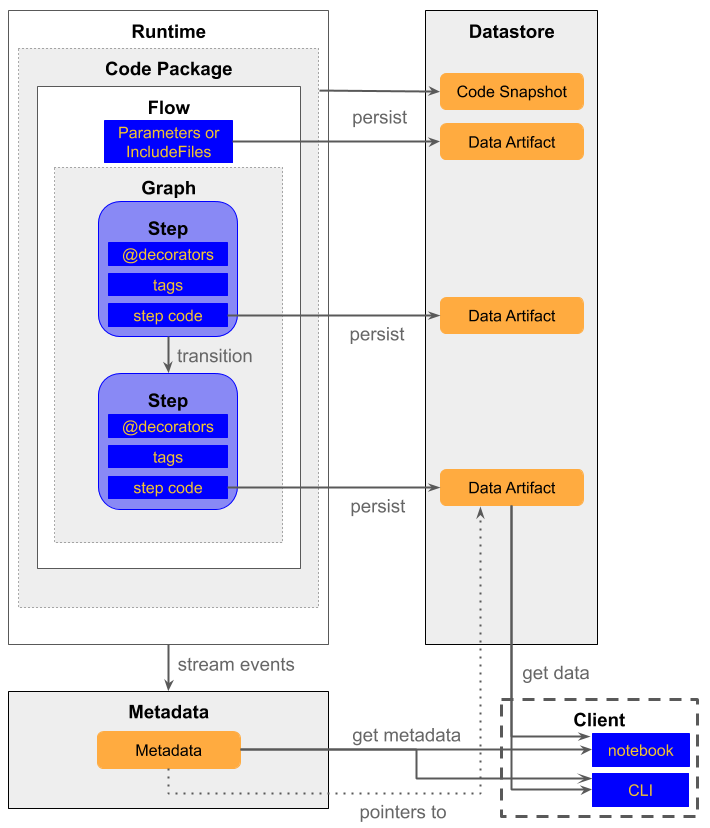
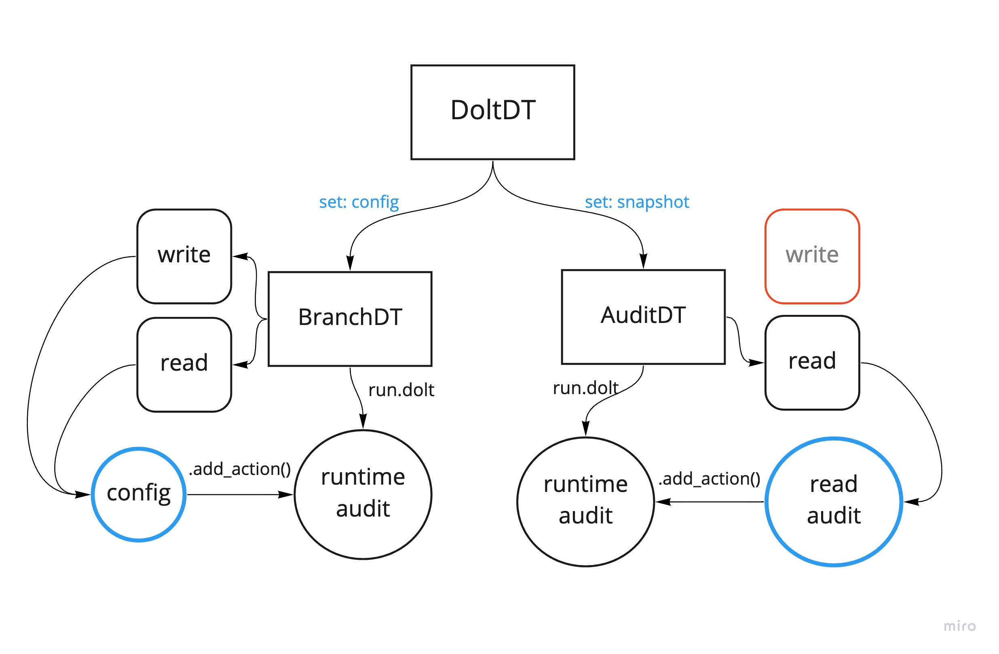

# Metaflow Dolt integration

## Dolt Background

[Dolt](https://github.com/dolthub/dolt) is a data tool
intersecting the features of Git and SQL.
Data is managed with the lifecycle of Git, bringing its rich feature-set
of transactional logging, merging and diffing to data. Dolt repositories that are
managed with a clone/push/pull lifecycle can also be accessed via SQL semantics, because 
selecting, joining and windowing is something we take for granted
when exploring data.

## Metaflow Background

[Metaflow](https://github.com/Netflix/metaflow) is a data scientist workflow tool for
that supports ease of experimentation for individuals
and easy collaboration for teams.

Code is packaged into "Flows," which are executed as instance "Runs."
Multiple "Steps" of code blocks comprise a Run, and all of the code, dependencies and
data artifacts of interest are serialized and saved for transparency, sharing and
reproducibility. The Metaflow Client API allows users to access and compare
these data and code artifacts afterwards using the Metaflow namespace hierarchy.

<p align="center">
  
</p>

## Integration Architecture

Dolt plugs into Metaflow to provide three main capabilities for data stored in Dolt:

1. Logging - records of interactions between Metaflow and Dolt
2. Merging - incremental table changes
3. Diffing - row differences and summaries of row differences

To provide these features, Dolt supplements Metaflow's artifact metadata
with an "audit" record of Dolt interactions. The DoltDT provides two interfaces
that automatically handle behind-the-scenes managing of Dolt "audits":

1. Acess Dolt tables pinned to a specific branch or commit (`DoltBranchDT`)
2. Access the versions of Dolt tables used in a different Metaflow
  Run (`DoltAuditDT`).
  
<p align="center">
  
</p>

Interface one pins workflow reads and writes
from a common branch starting point. The easiest way to access data from
Dolt is to checkout a database branch and
read the current version of a table. Similarly, we can checkout a
specific tag, commit, or date from which to read.

Interface two provides reproducibility between workflows in a context where
the unit of encapsulation is not a single commit. Metaflow runs can
checkout data from mulitple databases or multiple versions of the same
table, and write to new commits from the original parent commit.
For example, reproducing a workflow that reads and writes from a single branch
will reference two versions of the database -- the read and write commits.

We have provided the `DoltAuditDT`, a read-only tool that
uses namespace keys to load the versions of tables used in previous
workflows. You cannot write to a audit context manager because there
is no default database configuration. Tablename key collisions will
reference the most recently accessed version of the table, however this
can be avoided by manually specifying the audit namespace key
(example 4 below).

The data structure that maintains the workflow namespace is created
throughout running flows, and attached to Run objects as the `.dolt` metaflow artifact.
This metaflow artifact can be accessed from the Metaflow client API in
the same manner as other artifacts, and
used to initialize a audit DT (example 2 below). A
`DoltAuditDT` used during a running flow will maintain
two audits -- one for reading data, and a second for recording what
versions of data were accessed in the current flow for future
reproducibility.

## Example Uses

Example 1 (`demo.py`): read from Dolt database
```python3
conf = DoltConfig(database="foo")
with DoltDT(run=self, config=conf) as dolt:
    df = dolt.read("bar")
    dolt.write(df=df, table_name="baz")
```
- line 1: Configuration for the dolt database and root commit
- line 2: Dolt Datatool used similarly to S3 -- provide context manager to running flow
- line 3: Dolt returns dataframe for table name
- line 4: Dolt will stage a write to table `baz`
- line 5: Context manager exits, record of reads/writes persisted to a audit for the run

Example 2: reproducible audit
```python3
audit = Run("VersioningDemo/XX").data.dolt
print(json.dumps(audit, indent=4))
{
    "actions": {
        "bar": {
            "key": "bar",
            "config_id": "b139182f-97ec-41dc-b9b8-93729afa764f",
            "pathspec": "VersioningDemo/1611689861614781/start/1",
            "table_name": "bar",
            "kind": "read",
            "query": "SELECT * FROM `bar`",
            "commit": "v51ahsc6i6afphhc5q9uub7fjcq2sta4",
            "artifact_name": null,
            "timestamp": 1611689862.785563
        },
        "baz": {
            "key": "baz",
            "config_id": "b139182f-97ec-41dc-b9b8-93729afa764f",
            "pathspec": "VersioningDemo/1611689861614781/start/1",
            "table_name": "baz",
            "kind": "write",
            "query": null,
            "commit": "cldb7pohk69fic3s96de2r3okananr5n",
            "artifact_name": null,
            "timestamp": 1611689863.4338062
        }
    },
    "configs": {
        "b139182f-97ec-41dc-b9b8-93729afa764f": {
            "id": "b139182f-97ec-41dc-b9b8-93729afa764f",
            "database": "foo",
            "branch": "master",
            "commit": "v51ahsc6i6afphhc5q9uub7fjcq2sta4",
            "dolthub_remote": false,
            "push_on_commit": false
        }
    }
}
```
- line 1: access the dolt action metadata by Run ID
- action 1: we read table `bar` from database `foo` at commit `v51ahs`
- action 2: we wrote table `baz` to database `foo` in commit `cldb7p`
- config 1: we used one `DoltDT` with one database configuration

Example 3 (audit_demo.py): reproducible workflows with audit encapsulation
```python3
audit = Run("VersioningDemo/XX").data.dolt
dolt = DoltDT(run=self, audit=audit)
df = dolt.read("bar")
```
- line 1: load the dolt audit
- line 2: use the dolt audit as a read replica
- line 3: read the version of table `bar` specified in the audit namespace
- note: if `DoltAuditDT` is used as a context manager durign an active flow,
the configuration and read action from the reference audit would be saved into
the running flow's audit

Example 4: overlapping reads
```python3
with DoltDT(run=self, config=conf1) as dolt:
    df1 = dolt.read("bar", as_key="bar1")
with DoltDT(run=self, config=conf2) as dolt:
    df2 = dolt.read("bar", as_key="bar2")
```
- context 1: read table `bar` from configuration 1, with the audit
    namespace saving the read under key `bar1`
- context 2: read table `bar` from configuration 2, with the audit
    namespace saving the read action under key `bar2`

the resulting audit:
```
{
    "actions": {
        "bar1": {
            "key": "bar1",
            "table_name": "bar",
         ...
        "bar2": {
            "key": "bar2",
            "table_name": "bar",
         ...
```

Example 5 (`custom_query_demo.py`): custom SQL select
```python3
with DoltDT(run=self, config=conf) as dolt:
    df1 = dolt.select(q="SELECT * from `table` LIMIT 5;", as_key="first_five")
```
- manually specify a SQL select; `as_key` is required

resulting action:
```
"first_five": {
    "key": "first_five",
    "config_id": "b139182f-97ec-41dc-b9b8-93729afa764f",
    "pathspec": "VersioningDemo/1611689861614781/start/1",
    "table_name": None,
    "kind": "read",
    "query": "SELECT * from `table` LIMIT 5;",
    "commit": "cldb7pohk69fic3s96de2r3okananr5n",
    "artifact_name": null,
    "timestamp": 1611689863.4338062
}
```

Example 6 (in progress): DoltHub remote:
```python3
conf = DoltConfig(database="dolthub/doltpy", dolthub_remote=True)
with DoltDT(run=self, config=conf) as dolt:
    df = dolt.read("bar")
```
- automatically pull remote repos locally
- optionally push on commit

Example 7 (in progress): diffs
```python3
dolt = DoltDT(config=conf)
diff = dolt.diff(table="bar", other="master")
print(diff)
>
CREATE TABLE `bar` (
  `index` int unsigned NOT NULL,
  `A` int unsigned NOT NULL,
  `B` int unsigned NOT NULL,
  PRIMARY KEY (`index`)
) ENGINE=InnoDB DEFAULT CHARSET=utf8mb4;
INSERT INTO `bar` (`index`,`A`,`B`) VALUES (0,1,1);
INSERT INTO `bar` (`index`,`A`,`B`) VALUES (1,1,1);
INSERT INTO `bar` (`index`,`A`,`B`) VALUES (2,1,1);
INSERT INTO `bar` (`index`,`A`,`B`) VALUES (3,2,2);
INSERT INTO `bar` (`index`,`A`,`B`) VALUES (4,2,2);
INSERT INTO `bar` (`index`,`A`,`B`) VALUES (5,2,2);
CREATE TABLE `baz` (
  `level_0` int unsigned NOT NULL,
  `index` int unsigned NOT NULL,
  `A` int unsigned NOT NULL,
  `B` int unsigned NOT NULL,
  PRIMARY KEY (`level_0`,`index`,`A`,`B`)
) ENGINE=InnoDB DEFAULT CHARSET=utf8mb4;
INSERT INTO `baz` (`level_0`,`index`,`A`,`B`) VALUES (0,0,1,1);
INSERT INTO `baz` (`level_0`,`index`,`A`,`B`) VALUES (1,1,1,1);
INSERT INTO `baz` (`level_0`,`index`,`A`,`B`) VALUES (2,2,1,1);
INSERT INTO `baz` (`level_0`,`index`,`A`,`B`) VALUES (3,3,2,2);
INSERT INTO `baz` (`level_0`,`index`,`A`,`B`) VALUES (4,4,2,2);
INSERT INTO `baz` (`level_0`,`index`,`A`,`B`) VALUES (5,5,2,2);
```

Example 8 (in progress): trace artifact names in Dolt
```python3
with DoltDT(run=self, config=conf) as dolt:
    self.df = dolt.read("bar")
```
- artifact will record the association between the dolt read `bar` and the 
metaflow artifact `df`

resulting action:
```
"first_five": {
    "key": "first_five",
    "config_id": "b139182f-97ec-41dc-b9b8-93729afa764f",
    "pathspec": "VersioningDemo/1611689861614781/start/1",
    "table_name": None,
    "kind": "read",
    "query": "SELECT * from table LIMIT 5;",
    "commit": "cldb7pohk69fic3s96de2r3okananr5n",
    "artifact_name": "df",
    "timestamp": 1611689863.4338062
}
```

TODO:
1. Diffing
2. Record query strings, allow dolt.query
2. Bidirection metadata -- Dolt action references the metaflow artifact name
2. Bidirectional discovery -- search for flows/users with DoltSQL
2. Dolthub pulling/pushing easier -- fully qualified name, push on commit
