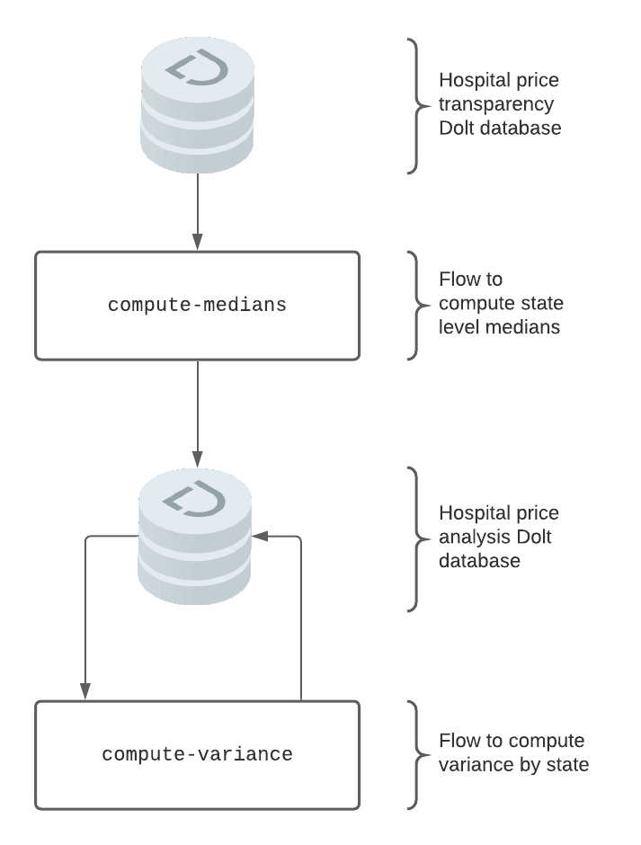
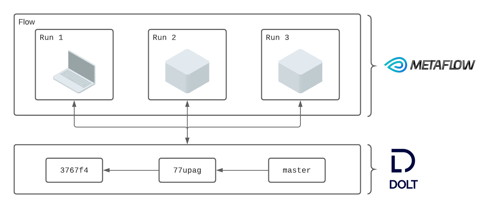
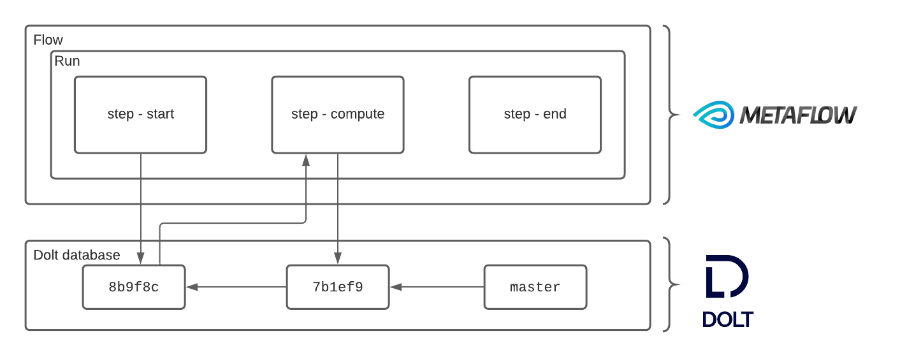

## Background
This post details how to use Metaflow with Dolt. [Metaflow](https://metaflow.org/) is a workflow manager that offers data scientists the ability to define local experiments and scale those experiments to production jobs from a single API. [Dolt](https://docs.dolthub.com/) is a version controlled relational database. It provides a familiar SQL interface along with Git-like version control features for capturing historical states. Each commit corresponds to a complete state of the database at the time the commit was created. Both Dolt and Metaflow are open source.

Using Dolt as a source and target for Metaflow jobs that users can reproduce, trace the lineage of, and employ complex back testing logic against.

## Example Pipeline
Our pipeline consists of two flows. One flow consumes the results written the other. The first flow computes the state level median price for a procedure. The second flow computes the variance of the price for a procedure across states. 



First we will form and test a hypothesis using our pipeline, a bit of Arm Chair Data Science. Then we will dive into some of the more capabilities the integration with Dolt offers Metaflow users. We will show how to use the Metaflow API with Dolt integration to:
- rerun the second flow using a pinned version of the data produced by the first flow, providing read isolation and reproducibility to our variance calculation
- given the result of the second flow trace the lineage of the data back to the upstream dataset

We are able to do all of this from the Metaflow API, allowing users to access powerful data version control features from the comfort of their workflow framework.

## How it Works
Workflows in Metaflow are called "flows." Each flow stores metadata about flow execution when it is run, referred to as a "run." Each time a run using the integration interacts with Dolt, it captures a small amount of metadata that makes that interaction completely reproducible. Since Dolt database root hashes are unique, this creates a mapping (roughly) between Metaflow runs and Dolt commits that can be exploited to provide users with powerful lineage and reproducibility features. 

At the level of the Flow, the integration looks like this:



Drilling into one of the runs:



This is all abstract, so let's install a few dependencies, grab a dataset, and get stuck some armchair data science.

## Setup
Let's get the boring stuff out of the way. We need the following:
- Dolt and `doltpy-integrations` installed
- Metaflow installed
- the sample dataset we will use, which can easily clone from DoltHub

### Install Dolt
The first step is to install Dolt on a `*nix` system:
```
sudo bash -c 'curl -L https://github.com/dolthub/dolt/releases/latest/download/install.sh | bash'
```

There are Windows distributions and a Homebrew cask. Find more details about installation [here](https://docs.dolthub.com/getting-started/installation).

### install doltpy-integrations[metaflow]
Next let's install the Metaflow + Dolt integration. It comes packaged with both Metaflow, and Dolt's Python API, Doltpy. It's easy enough to install via `pip`:
```
pip install doltpy-integraions[metaflow]
```

### Get The Data
The final step is to acquire the dataset. Dolt is a SQL database with Git-like version control features. That includes the ability to clone a remote to your local machine. We do that here:
```
$ dolt clone dolthub/hospital-price-transparency && cd hospital-price-transparency

```

Note this dataset is nearly 20 gigabytes, and could take a few minutes to clone. Once it's landed it's straightforward to jump write into SQL:
```
$ dolt sql
# Welcome to the DoltSQL shell.
# Statements must be terminated with ';'.
# "exit" or "quit" (or Ctrl-D) to exit.
hospital_price_transparency> show tables;
+-----------+
| Table     |
+-----------+
| cpt_hcpcs |
| hospitals |
| prices    |
+-----------+
```

Finally let's create a Dolt database for our downstream results:
```
$ mkdir ~/hospital-price-analysis && cd ~/hospital-price-analysis
$ dolt init
Successfully initialized dolt data repository.
```

Before starting to run our Metaflow flows, let's formulate a hypothesis to test.

## Arm Chair Data Science
We are going to use our example data pipeline, described at the outset, to test a hypothesis about our sample dataset. The data set we acquired is the result of a "data bounty." A data bounty is crowd sourced data gathering project sponsored by DoltHub. You can read more about this particular bounty in this blog [post](https://www.dolthub.com/blog/2021-03-03-hpt-bounty-review/).

The hypothesis we wish to test is this:
> As the observation count increases, the procedure level price variance should decrease

This is a crucial question in any data collection effort. The statistical regularity of the observations, combined with the cost of each observation, very directly impacts how effective such efforts are as a means of collecting data. 

As the bounty progressed, and participants added more data, our observation count grew. So we can test this hypothesis against various points in the commit graph. Let's jump into defining a Metaflow pipeline that will answer this question.

## Using Metaflow
Let's start by computing our medians:
```
> poetry run python3 hospital_procedure_price_state_medians.py run \ 
--hospital-price-db path/to/hospital-price-transparency
--hospital-price-analysis-db path/to/hospital-price-analysis
```

We can then compute the variances:
```
> poetry run python3 hospital_procedure_price_variance_by_state.py run \ 
--hospital-price-analysis-db path/to/hospital-price-analysis
```

We now have our first result set computed, and estimate of the state level variances. Let's access them via the Metaflow client API:
```
# access the computed variances
```

### Hypothesis
We stated that we wanted to measure the effect of accumulated procedure price observations on procedure variances across states. First, let's identify a list of commmits for which we wish to compute the results:
```
# here we need some commits
```

Now we can execute our flows at each commit:
```
# execute flows at each commit
```

Having created several result sets from upstream commits, we can now use the timestamps on those commits to the visualize some of the procedure level variance through time.
```
# compute a pooled variance (https://en.wikipedia.org/wiki/Pooled_variance) and plot
```

TODO conclusion about the hypothesis.

### Reproducibility
Suppose now that we want to make some changes to how we compute the variance. In particular we would like to eliminate statistical outliers, as we suspect they could be data errors. However, the medians may have been recomputed. We would like to directly compare the results of our code changes using the exact same input data.

Using the `DoltDT` class we can do this easily enough:
```
# grab the data audit
```

This produced a JSON file that can be passed to other Metaflow flows that will tell them how to access the data the run we used to generate the "audit." We can pass that audit file directly into our downstream flow:
```
# rerun the variances
```

This gave us the ability to test our code changes on fixed data inputs. It also gives us read isolation from data being updated as our job is running.

### Lineage
When browsing the data, let's say we notice an anomaly. Specifically, we have a table of variances and we would like to identify the input data to run some statistical tests against it. We can do that directly from the Metaflow API:
```
# pull out the medians table, test for outliers
```

We can then trace the inputs that were used to produce the state level medians, again directly from the Metaflow API:
```
# pull out the original prices dataset (limited selection)
```

By storing Metaflow results in Dolt, result sets can be associated with flows and the input datasets. When results from Metaflow are put into other data stores, we don't have a way to trace the table back to flow run that produced it. Furthermore, with Dolt's commit graph we cannot associate states with runs.

## Conclusion
In this post we defined a sample Metaflow pipeline, consisting of two flows, for analyzing a hospital price transparency dataset. By using Dolt as our upstream data source we were able to achieve read isolation, and implement arbitrary back-testing logic against the commit graph to test a hypothesis about the relationship between observation count and variance. We then showed how to use the Metaflow API to access results in Dolt directly. This access mechanism made Metaflow users results reproducible and enabled them to trace the lineage of a given output. 

We hope that users will see the value of integrating Dolt into their Metaflow based data science infrastructure.