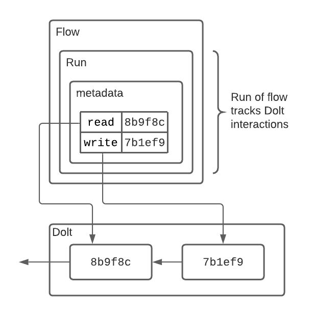
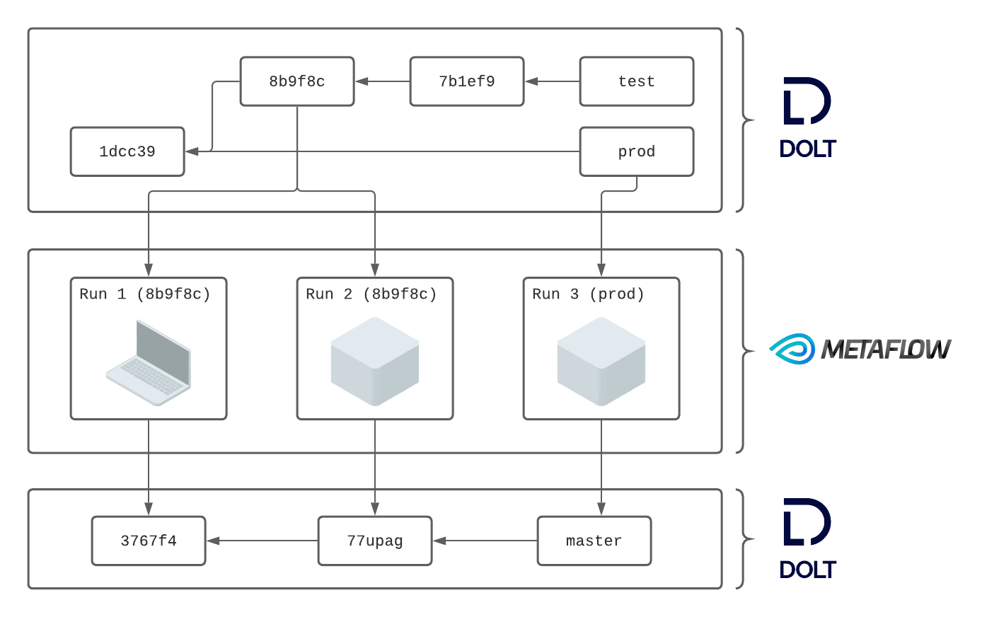

## Background
This post details how to use Metaflow with Dolt to create data pipelines that provide full reproducibility and lineage tracking capabilities. It is also not an end-to-end solution, meaning users can combine this with their existing data stores to solve problems without undertaking large scale infrastructure projects.

[Metaflow](https://metaflow.org/) allows users to define data science workflows natively in Python, called “Flows." Each run of a Flow is called a “Run”. Runs are stored in a metadata store, and can be retrieved after the fact. [Dolt](https://docs.dolthub.com/) is a version controlled relational database. It provides a familiar SQL interface along with Git-like version control features for capturing state. Each commit corresponds to a complete state of the database at the time the commit was created. Both Dolt and Metaflow are open source.


The Metaflow + Dolt in integration is provided by a separate Python package, `doltpy-integrations` installed with `metaflow` option. The integration works by Metaflow storing metadata about Dolt reads and writes. This means that after the fact runs can reproduce inputs and outputs without duplicating data. Metaflow just uses Dolt SQL to retrieve the specified data using recorded Metadata. At the individual flow level that looks something like this:



At flow definition level, each flow having multiple runs, that looks something like this:



This is all abstract, so let's install a few dependencies, grab a dataset, and get stuck into a concrete example using an open dataset from DoltHub.

## Setup
First, we want to get set up with a sample dataset and Flow to illustrate these new capabilities. DoltHub recently ran a “data bounty” to create a high quality SQL database of hospital pricing data. You can read more about how DoltHub obtained the data here.

### Install Dolt
The first step is to install Dolt on a `*nix` system:
```
sudo bash -c 'curl -L https://github.com/dolthub/dolt/releases/latest/download/install.sh | bash'
```

There are Windows distributions and a Homebrew cask. Find more details about installation [here](https://docs.dolthub.com/getting-started/installation).

### install doltpy-integrations[metaflow]
Next let's install the Metaflow + Dolt integration. It comes packaged with both Metaflow, and Dolt's Python API, Doltpy. It's easy enough to install via `pip`:
```
pip install doltpy-integraions[metaflow]
```

### Get The Data
The final step is to acquire the dataset. Dolt is a SQL database with Git-like version control features. That includes the ability to clone a remote to your local machine. We do that here:
```
$ dolt clone dolthub/hospital-price-transparency && cd hospital-price-transparency

```

Note this dataset is quite large, and could take a few minutes to clone. Once it's landed it's straightforward to jump write into SQL:
```
$ dolt sql
...
```

## Using Metaflow
We are going to show how to use Metaflow with Dolt by setting up a Flow to compute some aggregates on the hospital pricing dataset we acquired. In particular we would like to know how much median prices vary across states by procedure. Our Flow will perform have three steps
- `start`: compute and store state level medians for every procedure
- `variances`: compute procedure level variances across states
- `stop`: required by Metaflow

In this case `start` reads and computes an intermediate result. This result is stored to Dolt. `variances` uses this intermediate result to compute the data we want. The state level medians are not especially taxing to compute, but in a real world setting it's perfectly plausible that an intermediate result is used by many downstream jobs and cannot ergonomically be recomputed on the fly. Versioning provides read isolation to users of that intermediate result.

```
> poetry run python3 hospital_price_variance.py run \ 
--hospital-price-db path/to/hospital-price-transparency
--hospital-price-analysis-db path/to/hospital-price-analysis
```

```python
    @step
    def start(self):
        read_conf = DoltConfig(database=self.hospital_price_db, branch=self.hospital_branch)
        with DoltDT(run=self, config=read_conf) as dolt:
            prices_by_state = """
                SELECT
                  h.state,
                  p.code,
                  p.payer,
                  p.price
                FROM
                  prices p
                  LEFT JOIN hospitals h ON p.npi_number = h.npi_number;
            """
            prices = dolt.sql(prices_by_state, as_key="prices")

        median_price_by_state = prices.groupby(['state', 'code']).median()

        write_conf = DoltConfig(database=self.hospital_price_analysis_db)
        with DoltDT(run=self, config=write_conf) as dolt:
            dolt.write(
                median_price_by_state,
                "state_procedure_medians",
                ["state", "code"]
            )

    @step
    def variances(self):
        analysis_conf = DoltConfig(database=self.hospital_price_analysis_db, branch=self.hospital_branch)
        with DoltDT(run=self, config=analysis_conf) as dolt:
            median_price_by_state = dolt.read("state_procedure_medians")
            variance_by_procedure = median_price_by_state.groupby("code").var()
            dolt.write(variance_by_procedure, "variance_by_procedure")
```

Let's access that result via the Meatflow API to make clear the mechanism of the integration:
```
from metaflow import Flow
from doltpy_integrations.metaflow import 
dolt = DoltDT(run=self, audit=Flow("HospitalPriceVariance").latest_successful_run)
df = dolt.read("variance_by_procedure")
```

The `DoltDT` class knows how to use a Metaflow `Run` instance to resolve to a commit, and return the exact tables that were read or written.

### Lineage
Now suppose that we use the same method to access the medians we used to compute procedure variances across states:

```
from metaflow import Flow
from doltpy_integrations.metaflow import 
dolt = DoltDT(run=self, audit=Flow("HospitalPriceVariance").latest_successful_run)
df = dolt.read("state_procedure_medians")
```

We just pulled in the intermediate dataset that was used to compute the variances directly from the Metaflow client. 

### Reproducibility
Suppose now that we make a series of changes to our Metaflow job to correct for how we are computing the variances. The upstream dataset has been changing, but we want to verify that our code changes produce the desired results by fixing the input data:

```
> poetry run python3 hospital_price_variance.py run \ 
--historical-run-path HospitalPriceVariance/XX
--hospital-price-analysis-db path/to/hospital-price-analysis
```

We have now executed our updated code on an exact copy of the data our original analysis ran against. We can immediately examine the results and verify them:

```
from metaflow import Flow
from doltpy_integrations.metaflow import 
dolt = DoltDT(run=self, audit=Flow("HospitalPriceVariance").latest_successful_run)
df = dolt.read("variance_by_procedure")
# TODO we can show a diff here
```

### Back-testing
Our input dataset is coming from Dolt, the hospital price transparency dataset. Suppose that we are training a model using this dataset. We need a training and testing dataset. We can do that by selecting a subset of commits on our upstream database, and use that selection to train and test our model:
```
# TODO sample commit graph and execute test/train
```

## Conclusion
In this post we saw how to use Dolt from Metaflow. Dolt is a version controlled SQL database, and Metaflow is a framework or defining data engineering and data science jobs. The Metaflow + Dolt integraion allows to use Dolt directly from the Metaflow API without having to learn new concepts. At the same time users that know Dolt, or SQL and Git, can use Dolt directly to manage and interpret the results of their Metaflow jobs that are written to their Dolt databases.

We hope to enable both Dolt and Metaflow users to augment their existing data infrastructure with new capabilities that work with their existing toolchain.