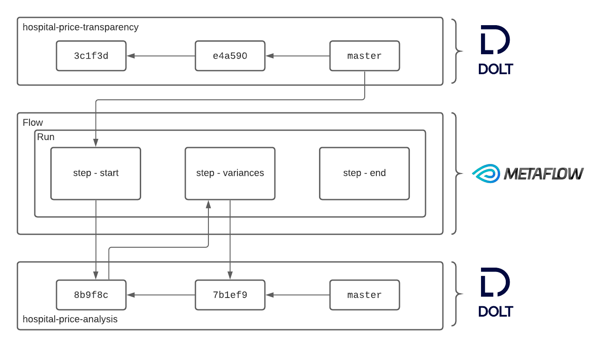

## Background
This post details how to use Metaflow with Dolt. [Metaflow](https://metaflow.org/) is a workflow manager that offers data scientists the ability to define small experiments and production jobs from a single API. [Dolt](https://docs.dolthub.com/) is a version controlled relational database. It provides a familiar SQL interface along with Git-like version control features for capturing state. Each commit corresponds to a complete state of the database at the time the commit was created. Both Dolt and Metaflow are open source.

The `doltpy-integrations` Python package provides hooks that make it easy to use Dolt from Metaflow. Metaflow stores metadata about flow execution, referred to as a "run." Each time a flow that interacts with Dolt via the integration Metaflow captures a small amount of metadata that makes that interaction completely reproducible. Since Dolt database root hashes are unique, this creates a mapping between Metaflow runs and Dolt commits that can be exploited to provide users with powerful lineage and reproducibility features. 

At the level of the Flow, the integration looks like this:


Drilling into one of the runs:


This is all abstract, so let's install a few dependencies, grab a dataset, and get stuck some armchair data science.

## Setup
Let's get the boring stuff out of the way. We need the following:
- Dolt and `doltpy-integrations` installed
- Metaflow installed
- the sample dataset we will use, which can easily clone from DoltHub

### Install Dolt
The first step is to install Dolt on a `*nix` system:
```
sudo bash -c 'curl -L https://github.com/dolthub/dolt/releases/latest/download/install.sh | bash'
```

There are Windows distributions and a Homebrew cask. Find more details about installation [here](https://docs.dolthub.com/getting-started/installation).

### install doltpy-integrations[metaflow]
Next let's install the Metaflow + Dolt integration. It comes packaged with both Metaflow, and Dolt's Python API, Doltpy. It's easy enough to install via `pip`:
```
pip install doltpy-integraions[metaflow]
```

### Get The Data
The final step is to acquire the dataset. Dolt is a SQL database with Git-like version control features. That includes the ability to clone a remote to your local machine. We do that here:
```
$ dolt clone dolthub/hospital-price-transparency && cd hospital-price-transparency

```

Note this dataset is quite large, and could take a few minutes to clone. Once it's landed it's straightforward to jump write into SQL:
```
$ dolt sql
...
```

## Arm Chair Data Science
We are going to demonstrate a sample flow defined in Metaflow that is designed to a hypothesis about our sample dataset. The data set we acquired is the result of a "data bounty." A data bounty is crowd sourced data gathering project sponsored by DoltHub. You can read more about this particular bounty in this blog [post](https://www.dolthub.com/blog/2021-03-03-hpt-bounty-review/).

The hyposthesis we wish to test is this:
> As the observation count increases, the procedure level price variance should decrease

Let's jump into defining a Metaflow pipeline that will answer this question.

## Using Metaflow
In this case we are using Dolt as the input, as well as for storing intermediate results and outputs. In many use-cases the upstream datasource might come from a data warehouse of some kind. The architecture for our flow looks something like:


Our flow has three steps:
- `start`: compute and store state level medians for every procedure
- `variances`: compute procedure level variances across states
- `end`: required by Metaflow

In this case `start` reads and computes an intermediate result. This result is stored to Dolt. `variances` uses this intermediate result to compute the data of interest. The state level medians are not especially taxing to compute, but in a real world setting it's perfectly plausible that an intermediate result is used by many downstream jobs and cannot ergonomically be recomputed on the fly. Versioning provides read isolation to users of that intermediate result. This what the flow looks like schematically:


The Flow can be run as follows:
```
> poetry run python3 hospital_price_variance.py run \ 
--hospital-price-db path/to/hospital-price-transparency
--hospital-price-analysis-db path/to/hospital-price-analysis
```

```python
    @step
    def start(self):
        read_conf = DoltConfig(database=self.hospital_price_db, branch=self.hospital_branch)
        with DoltDT(run=self, config=read_conf) as dolt:
            prices_by_state = """
                SELECT
                  h.state,
                  p.code,
                  p.payer,
                  p.price
                FROM
                  prices p
                  LEFT JOIN hospitals h ON p.npi_number = h.npi_number;
            """
            prices = dolt.sql(prices_by_state, as_key="prices")

        median_price_by_state = prices.groupby(['state', 'code']).median()

        write_conf = DoltConfig(database=self.hospital_price_analysis_db)
        with DoltDT(run=self, config=write_conf) as dolt:
            dolt.write(
                median_price_by_state,
                "state_procedure_medians",
                ["state", "code"]
            )

    @step
    def variances(self):
        analysis_conf = DoltConfig(database=self.hospital_price_analysis_db, branch=self.hospital_branch)
        with DoltDT(run=self, config=analysis_conf) as dolt:
            median_price_by_state = dolt.read("state_procedure_medians")
            variance_by_procedure = median_price_by_state.groupby("code").var()
            dolt.write(variance_by_procedure, "variance_by_procedure")

    @step
    def end(self):
        pass
```

Let's access that result via the Meatflow API to make clear the mechanism of the integration:
```
from metaflow import Flow
from doltpy_integrations.metaflow import 
dolt = DoltDT(run=self, audit=Flow("HospitalPriceVariance").latest_successful_run)
df = dolt.read("variance_by_procedure")
# TODO show the dataset here
```

The `DoltDT` class knows how to use a Metaflow `Run` instance to resolve to a commit, and return the exact tables that were read or written. Let's move on to examine what this actually enables Metaflow users to do in practice.

### Lineage
Now suppose that we use the same method to access the medians we used to compute procedure variances across states:

```
from metaflow import Flow
from doltpy_integrations.metaflow import 
dolt = DoltDT(run=self, audit=Flow("HospitalPriceVariance").latest_successful_run)
df = dolt.read("state_procedure_medians")
```

We just pulled in the intermediate dataset that was used to compute the variances directly from the Metaflow client. Now

### Reproducibility
Suppose now that we make a series of changes to our Metaflow job to correct for how we are computing the variances. The upstream dataset has been changing, but we want to verify that our code changes produce the desired results by fixing the input data:

```
> poetry run python3 hospital_price_variance.py run \ 
--historical-run-path HospitalPriceVariance/XX
--hospital-price-analysis-db path/to/hospital-price-analysis
```

We have now executed our updated code on an exact copy of the data our original analysis ran against. We can immediately examine the results and verify them:

```
from metaflow import Flow
from doltpy_integrations.metaflow import 
dolt = DoltDT(run=self, audit=Flow("HospitalPriceVariance").latest_successful_run)
df = dolt.read("variance_by_procedure")
# TODO we can show a diff here
```

### Back-testing
Our input dataset is coming from Dolt, the hospital price transparency dataset. Suppose that we are training a model using this dataset. We need a training and testing dataset. We can do that by selecting a subset of commits on our upstream database, and use that selection to train and test our model:
```
# TODO sample commit graph and execute test/train
```

## Conclusion
In this post we saw how to use Dolt from Metaflow. Dolt is a version controlled SQL database, and Metaflow is a framework or defining data engineering and data science jobs. The Metaflow + Dolt integration allows Metaflow users to use Dolt directly from the Metaflow API without having to learn new concepts. At the same time users that know Dolt, or SQL and Git, can use Dolt directly to manage and interpret the results of their Metaflow jobs that are written to their Dolt databases.