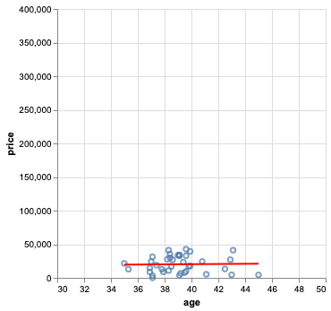
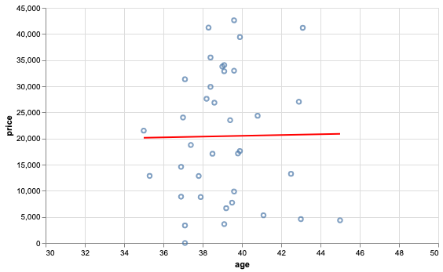

## Introduce Problem

We heard a rumor that Florida gives cheap hip transplants
due to its wealth of senior residents. We will
use the Hospital Price Transparency bounty data to test that hypothesis,
and search for a relationship between procudure price and a state's median age.

To do so requires two datasets:
- age
- prices

## Flow 1: Plot correlation

```
> poetry run python3 flow1.py run
```
Show graph. (code 1 + master 1 plot)
<p align="center">
  
</p>

Comment on correlation. What's with the outlier? We'll get to that in part 2.

(code 1 comments)
```python
    @step
    def start(self):

        with DoltDT(run=self, config=DoltConfig(database="state-age")) as dolt:
            age = dolt.read("age")

        conf = DoltConfig(database="hospital-price-transparency", branch=self.hospital_branch)
        with DoltDT(run=self, config=conf) as dolt:
            get_prices_per_state = """
                SELECT AVG(p.price) as price, state
                FROM `prices` as p
                JOIN `hospitals` as h
                ON p.npi_number = h.npi_number
                WHERE p.code = "27130"
                GROUP BY h.state
            """
            prices = dolt.sql(get_prices_per_state, as_key="prices")
```


What did we learn here: Metaflow basics, flow issues query -- get data, plot data.

## Flow 2: Code change, db reference

MN looks weird, lets drop data point in code and re-run. 

Show graph. (code 2 + master 1 plot)
<p align="center">
  
</p>

(code 2 comments)
Use dolt audit to make sure we're using the same data as flow 1.
```python
    @step
    def start(self):

        audit = Run(f"Flow1").latest_successful.data.dolt
        with DoltDT(run=self, audit=audit) as dolt:
            age = dolt.read("age")

        with DoltDT(run=self, audit=audit) as dolt:
            prices = dolt.read("prices")
            prices = prices[prices.price < 90000000]
```

What did we learn here -- metaflow records source code, parameters,
metadata. Dolt audits the version of dataset used in the two flows.

## Flow 3: Attribution

Let's find who uploaded the MN data for attribution. git blame -> find commit and person.
(found outlier in commit x, blame user y)

First we'll delete the rows of interest from a new branch `delete_outliers`
```bash
> dolt sql --query "DELETE FROM prices WHERE price > 10000000 AND code = '27130'"
Query OK, 1 row affected
```

and then view the changes:
```bash
> dolt diff prices
diff --dolt a/prices b/prices
--- a/prices @ 5835o3gtg69dmvfhq6mnvvl24spvh5hf
+++ b/prices @ 6f93dusr9fm7uah055k0te1rmp3dr50v
+-----+-------+------------+-------------------------+-------------+
|     | code  | npi_number | payer                   | price       |
+-----+-------+------------+-------------------------+-------------+
|  -  | 27130 | 1154959880 | Procedure/Charge Number | 98227130.00 |
+-----+-------+------------+-------------------------+-------------+
```

New branch from a flow that drops excessive outliers.

What did we learn here -- Dolt keeps track of data lineage, academic attribution, diffs
help understand how a contribution changes dataset.

## Flow 4: Time-travel

In step 2 we changed the source code. Lets re-run code 1 with new data.
```
> poetry run python3 flow1.py run --outfile flow3.png --hospital-branch remove_outliers
```

<p align="center">
  
</p>
Re-run step 1 code with a different commit.
